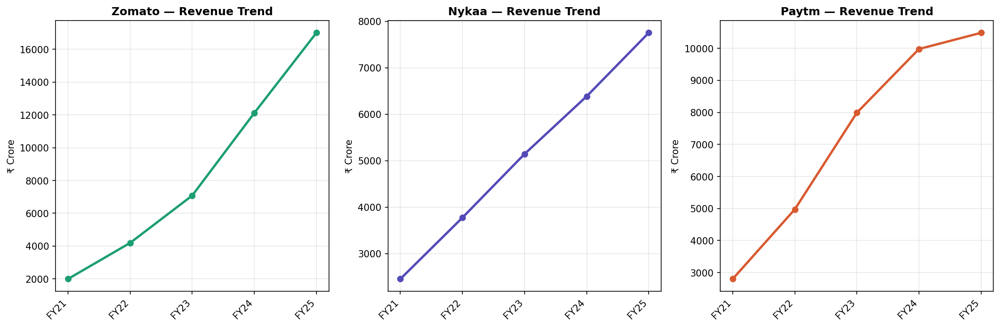
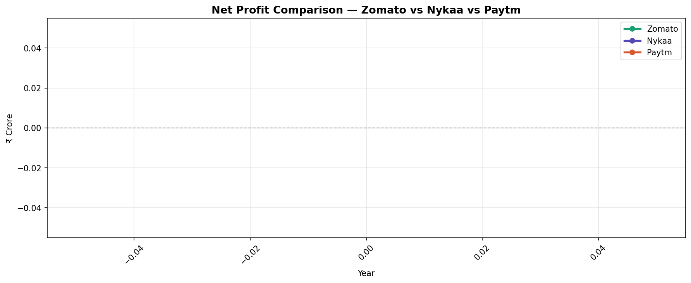
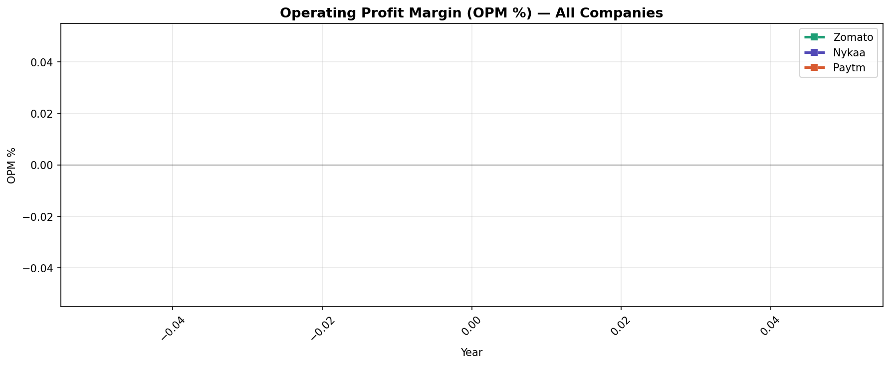

# Business Health Monitor — AI-Powered Company Diagnostics

> Analysing the financial health of Zomato (Eternal), Nykaa, and Paytm using Python, SQL,
> and a Gemini AI report generator that outputs plain-English diagnostics —
> the way a junior consultant would brief a client.

---

## Project previews







---

## What this project does

Most financial dashboards show you numbers. This one tells you what those numbers mean.

The pipeline ingests 5 years of P&L data for three high-profile Indian companies,
runs SQL-based diagnostics across revenue growth, cost efficiency, and margin risk,
and feeds the results into Google Gemini to generate a plain-English health briefing
for each company — the kind a junior analyst would hand to a client on Day 1.

---

## Key findings

- **Zomato** grew revenue from ₹1,994 Cr (FY21) to ₹17,003 Cr (FY25) — CAGR ~71% —
  and crossed into operating profitability in FY25 with OPM of +10%
- **Nykaa** showed the most consistent growth trajectory (CAGR ~33%) and avoided
  the deep losses seen in its new-age peers
- **Paytm** remained loss-making through FY24, OPM bottoming at -72% in FY21,
  before recovering to +2% in FY25 post-restructuring
- All 3 companies had negative OPM in FY21–FY22 — typical for Indian new-age
  companies in the 2–3 years post-IPO

---

## AI-generated health report sample (Zomato)

> Zomato (Eternal) has demonstrated exceptional revenue momentum, growing from
> ₹1,994 crore in FY21 to ₹17,003 crore in FY25 — a CAGR of approximately 71%.
> The acceleration in FY24 and FY25 suggests the business has moved beyond its
> early hyper-growth phase into a more sustainable expansion cycle.
>
> Zomato crossed into operating profitability in FY25 with an OPM of 10% and net
> profit of ₹527 crore — a dramatic turnaround from losses exceeding ₹1,200 crore
> as recently as FY22. The improvement in cost efficiency reflects better unit
> economics across its delivery network.
>
> The primary risk is margin sustainability as it scales quick-commerce (Blinkit),
> which requires continued dark store investment. The recommendation is to monitor
> the Blinkit contribution margin quarterly — if unit economics deteriorate for two
> consecutive quarters, it warrants a strategic reassessment of capital allocation.

---

## Tech stack

| Tool | Purpose |
|------|---------|
| Python (pandas) | Data ingestion, cleaning, metric calculation |
| SQLite + SQL | YoY growth, cost ratios, risk flags, company rankings |
| Matplotlib / Seaborn | Financial trend visualisations |
| Google Gemini API | Plain-English AI health report generation |
| Jupyter Notebooks | End-to-end reproducible pipeline |

---

## Pipeline architecture

```
Raw financial data (Screener.in)
        ↓
01_eda.ipynb        — load, clean, visualise (revenue, profit, OPM trends)
        ↓
02_analysis.ipynb   — SQL diagnostics (YoY growth, cost ratios, risk flags, rankings)
        ↓
03_gemini_reports.ipynb — Gemini AI health report generation per company
        ↓
outputs/            — companies_clean.csv, risk_flags.csv, health_reports.json
```

---

## SQL diagnostics included

- **YoY revenue growth** — year-on-year sales acceleration per company using window functions
- **Cost efficiency ratio** — expenses as % of revenue tracked across 5 years
- **Margin risk flags** — CASE WHEN logic flags any year OPM declined vs prior year
- **Latest year ranking** — companies ranked by OPM and revenue for FY25

---

## How to run locally

```bash
git clone https://github.com/anushkaagupta29/business-health-monitor.git
cd business-health-monitor
python3.11 -m venv .venv && source .venv/bin/activate
pip install -r requirements.txt
```

Add your Gemini API key to `.env`:
```
GEMINI_API_KEY=your_key_here
```

Run notebooks in order:
```
notebooks/01_eda.ipynb              data loading, cleaning, charts
notebooks/02_analysis.ipynb         SQL diagnostics and CSV exports
notebooks/03_gemini_reports.ipynb   AI health report generation
```

---

## Project structure

```
business-health-monitor/
├── images/
│   ├── revenue_trend.png
│   ├── net_profit_comparison.png
│   └── opm_comparison.png
├── notebooks/
│   ├── 01_eda.ipynb
│   ├── 02_analysis.ipynb
│   └── 03_gemini_reports.ipynb
├── outputs/
│   ├── companies_clean.csv
│   ├── revenue_growth.csv
│   ├── risk_flags.csv
│   ├── company_rankings.csv
│   └── health_reports.json
├── sql/
│   └── company_metrics.sql
├── .env                    ← not committed — add your Gemini API key here
├── .gitignore
├── requirements.txt
└── README.md
```

---

## Why these companies

Zomato, Nykaa, and Paytm are three of the most closely watched Indian new-age
companies — all listed post-2021, all with volatile financials, and all known to
every recruiter at Indian consulting and tech firms. Analysing them signals
familiarity with the Indian business landscape, not just generic Western datasets.

---

## Author

**Anushka Gupta** — CS @ MIT Manipal
[LinkedIn](https://www.linkedin.com/in/anushka-gupta-9a06a439b/) · anushkaguptacoreinbox@gmail.com